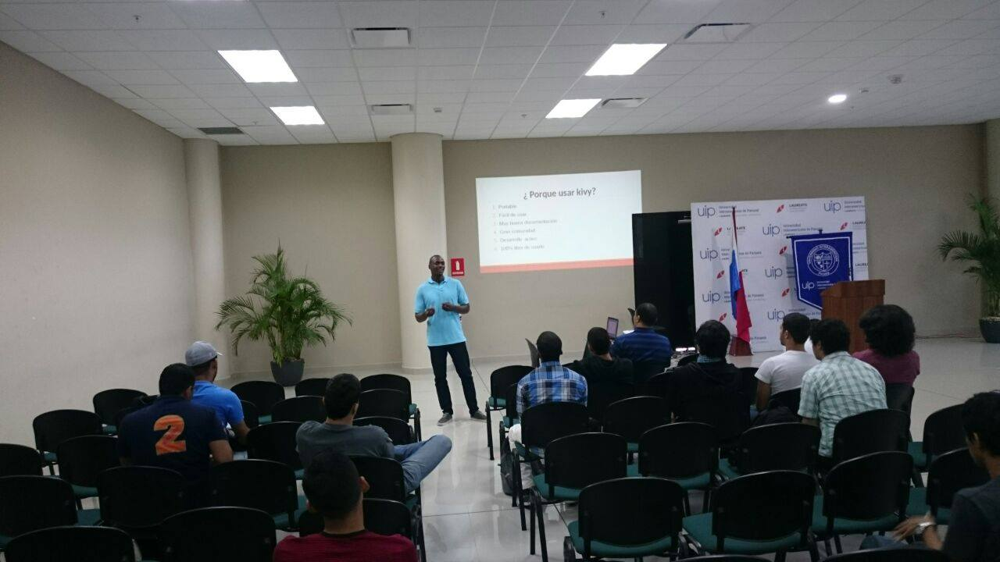
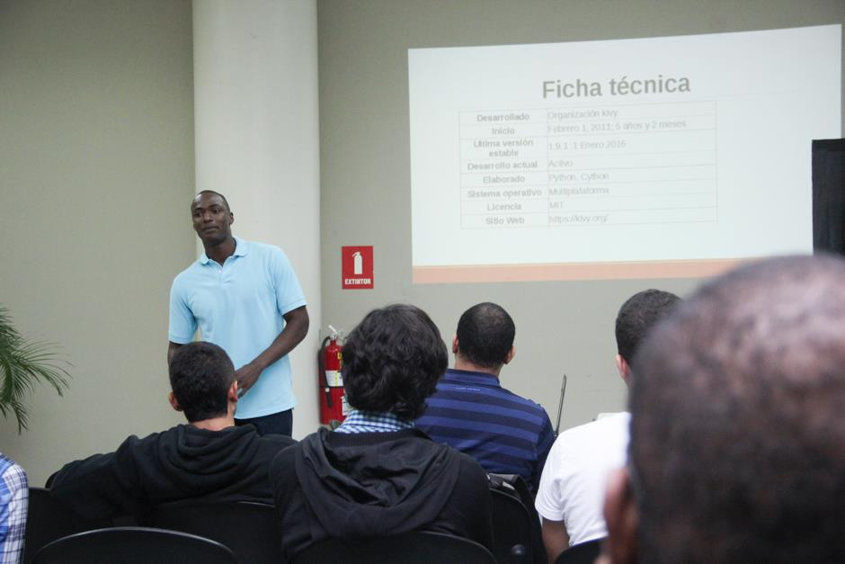
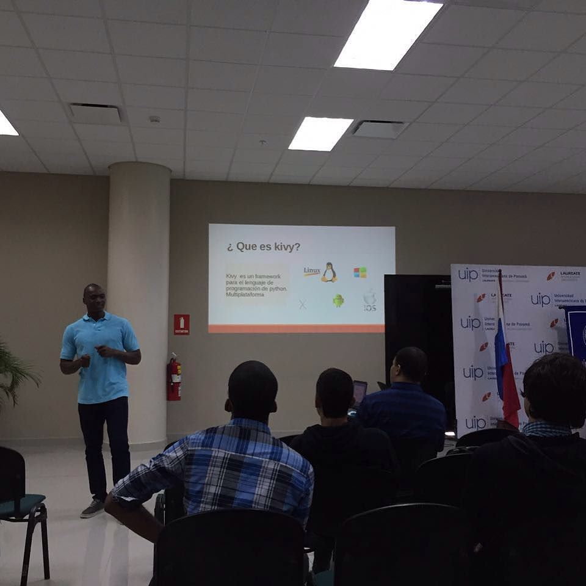
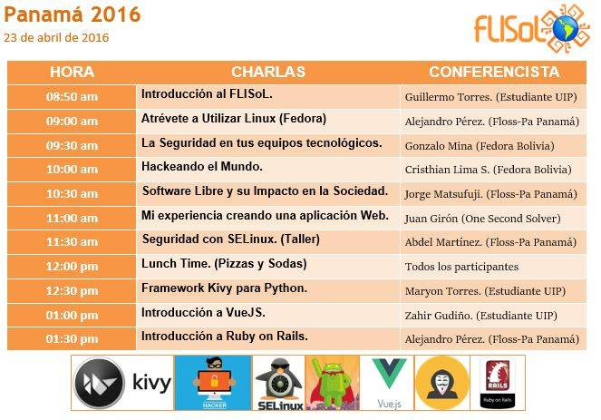

## EVENTO FLISOL ( Festival Latinoamericano de Instalación de Software Libre) 2016

- **Expositor:** Maryon Jose Torres R.
- **Fecha:**23 de abril del 2016.
- **Lugar:** Universidad Interammericana de panama

##Tema:  `FRAMEWORK KIVY PARA PYTHON`
Muy contento por haber participado de mi primer evento como expositor. fue una experiencia fenomenal, aunque los nervios de punta pero lo importante a ver compartirdo mi poco conocimientos con los demas. y muchas gracias a  Floss-Pa y Fedora Panamá por darme la oportunidad. 
 
###Comparto Algunas imagenes :

                       
                       
## Licencia
El código de este repositorio está bajo la licencia MIT (ver archivo LICENSE).