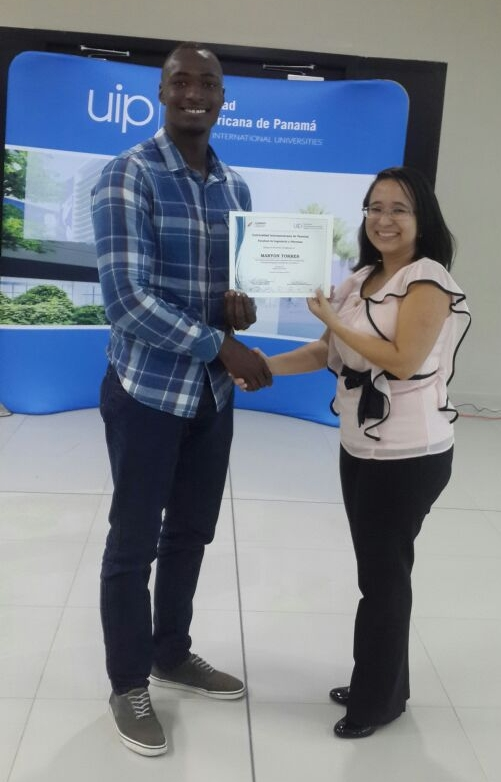
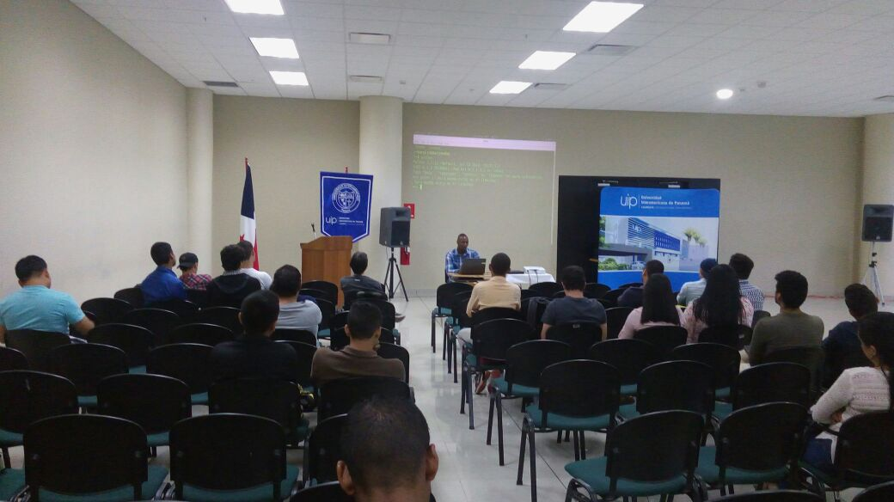
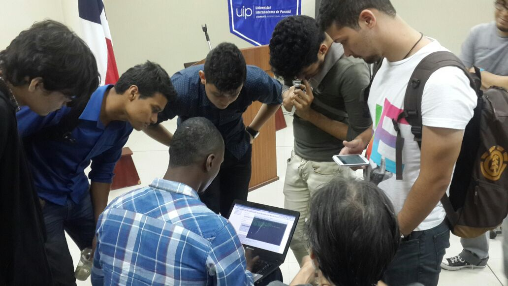
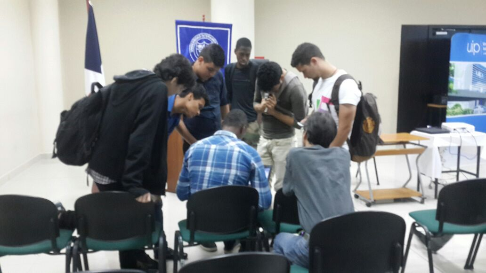

## EVENTO LINUXDAY 2016

- **Expositor:** Maryon Jose Torres R.
- **Fecha:**6 de agosto del 2016.
- **Lugar:** Universidad Interammericana de panama

##Tema:  `PRIMEROS PROYECTOS USANDO LINUX Y PYTHON`
Muy contento por haber participado de este gran evento y por tener la dicha de poder compartido un poco de mi conocimiento con las demás personas. Tambien quiero darle las gracias a Floss-Pa y Fedora Panamá por darme la oportunidad de estar en este gran evento. 
 
###Comparto Algunas imagenes :

                       
                       
## Licencia
El código de este repositorio está bajo la licencia MIT (ver archivo LICENSE).